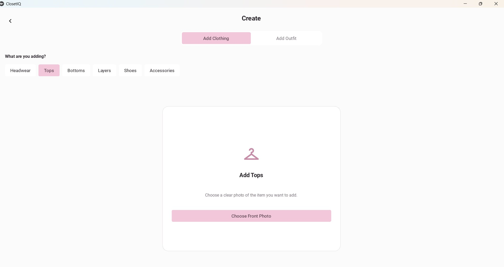
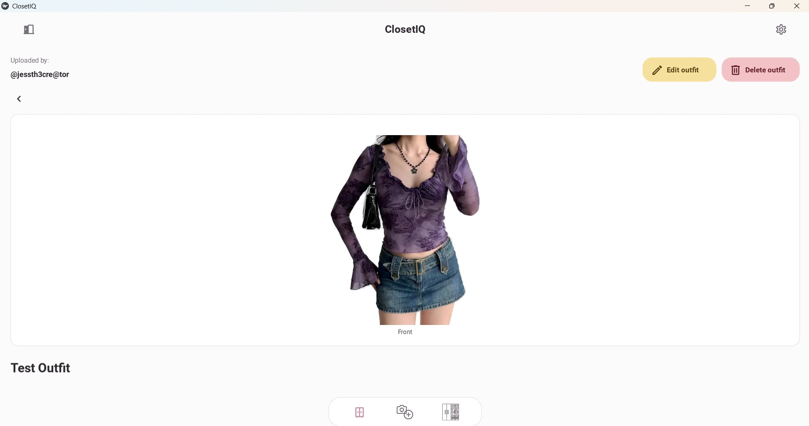
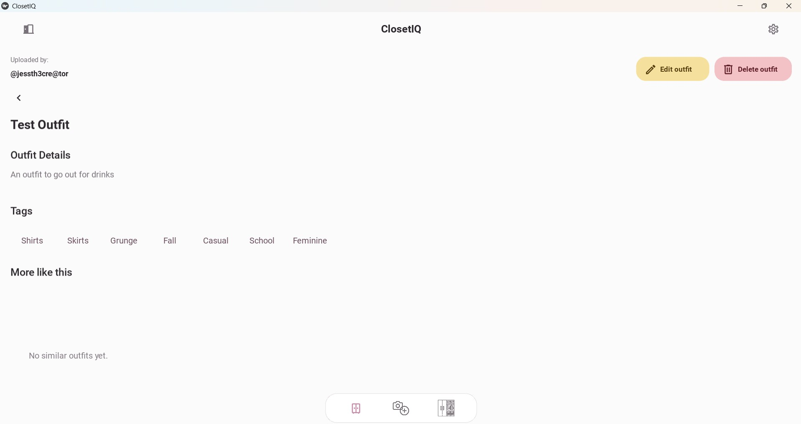
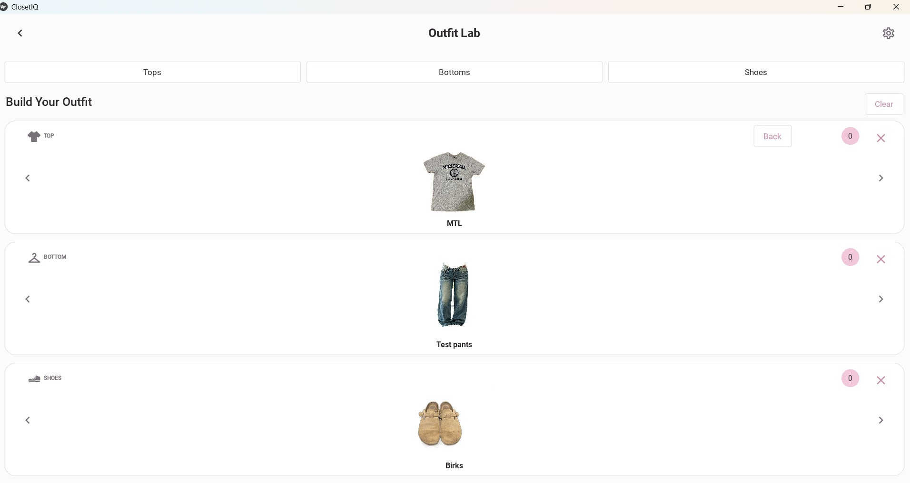

# ClosetIQ

**An offline-first digital wardrobe for organizing clothing and creating outfits.**

Inspired by Cher's virtual closet in *Clueless*, ClosetIQ takes a modern twist as a personal wardrobe application. Users can digitize their clothing, organize their closet, create and save outfits, and experiment with outfit combinations — all locally on their device.

## Features

- Digital wardrobe management
- Clothing categories and tags
- Photo import and clothing image editing
- Multiple garment views
- Outfit creation and saved outfit cards
- Interactive Outfit Lab
- Local image and wardrobe storage
- Fully offline operation

## Built With

- Python
- Kivy / KivyMD
- Local persistent storage
- Image processing

## Screenshots

### Digital Wardrobe

Organize clothing locally by category and browse your personal wardrobe.

### Add Clothing

Add clothing to your digital wardrobe by category using your own photos.

### Saved Outfits

Create, save, view, edit, and manage outfits with clothing details and tags.

### Outfit Lab

Experiment with tops, bottoms, and shoes from your wardrobe to build outfit combinations.

## Project Status

ClosetIQ is actively being developed, with the current focus on the offline personal wardrobe experience.

## About This Repository

This repository is a portfolio showcase for ClosetIQ. The application's source code is maintained privately.
